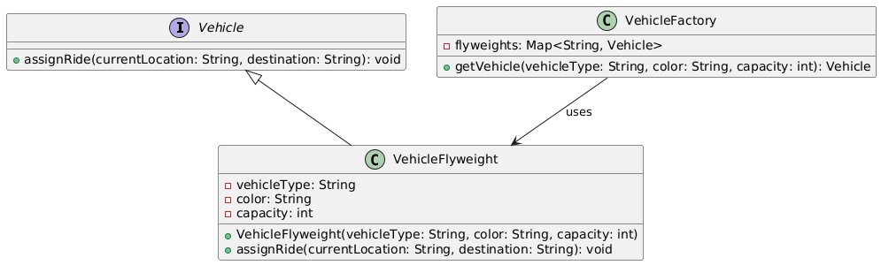

# Flyweight Pattern in Java

## **What is the Flyweight Pattern?**
The **Flyweight Pattern** is a **structural design pattern** that focuses on reducing memory usage by sharing common parts of objects. Instead of creating multiple instances of similar objects, it allows sharing of intrinsic state (data that doesn’t change between objects), while externalizing unique data as extrinsic state.

---

## **Why Use the Flyweight Pattern?**

1. **Memory Optimization**: 
   - Reduces the number of objects in memory by reusing shared data.
   - Particularly useful in systems where many objects share common properties.

2. **Improved Performance**:
   - Avoids frequent creation of new objects, reducing CPU and memory overhead.

3. **Scalability**:
   - Helps manage a large number of similar objects effectively.

4. **Real-World Examples**:
   - Applications with repetitive objects like GUI components, text editors, or large-scale systems like a ride-sharing app where vehicle details can be shared.

---

## **How It Works**

The Flyweight Pattern separates object data into:
- **Intrinsic State**: Shared data that is constant across many objects (e.g., vehicle type, color, capacity in a ride-sharing app).
- **Extrinsic State**: Unique data that varies across instances and is passed dynamically (e.g., current location and destination).

### **Key Components**
1. **Flyweight Interface**: Defines methods for objects with shared data.
2. **Concrete Flyweight**: Stores intrinsic state and provides methods to handle extrinsic data.
3. **Flyweight Factory**: Manages the creation and reuse of flyweight objects, ensuring that identical intrinsic states are shared.
4. **Client**: Uses flyweight objects and provides extrinsic data.

---

## UML Diagram


## **Example: Ride-Sharing Project**

### **Scenario**
In a ride-sharing app, vehicles have attributes like `type`, `color`, and `capacity` (intrinsic). Each ride has unique details like `current location` and `destination` (extrinsic). The Flyweight Pattern optimizes the system by reusing vehicle objects with the same intrinsic properties.

---

### **Step 1: Flyweight Interface**
```java
interface Vehicle {
    void assignRide(String currentLocation, String destination); // Handles extrinsic data
}
```

---

### **Step 2: Concrete Flyweight**
```java
class VehicleFlyweight implements Vehicle {
    private final String vehicleType; // Intrinsic state
    private final String color;       // Intrinsic state
    private final int capacity;       // Intrinsic state

    public VehicleFlyweight(String vehicleType, String color, int capacity) {
        this.vehicleType = vehicleType;
        this.color = color;
        this.capacity = capacity;
    }

    @Override
    public void assignRide(String currentLocation, String destination) {
        System.out.println("Ride Assigned -> Type: " + vehicleType + ", Color: " + color +
                ", Capacity: " + capacity + ", Location: " + currentLocation + ", Destination: " + destination);
    }
}
```

---

### **Step 3: Flyweight Factory**
```java
import java.util.HashMap;
import java.util.Map;

class VehicleFactory {
    private final Map<String, Vehicle> flyweights = new HashMap<>();

    public Vehicle getVehicle(String vehicleType, String color, int capacity) {
        String key = vehicleType + ":" + color + ":" + capacity;

        if (!flyweights.containsKey(key)) {
            flyweights.put(key, new VehicleFlyweight(vehicleType, color, capacity));
            System.out.println("Creating new vehicle flyweight for: " + key);
        } else {
            System.out.println("Reusing existing flyweight for: " + key);
        }

        return flyweights.get(key);
    }
}
```

---

### **Step 4: Client Code**
```java
public class RideSharingFlyweightDemo {
    public static void main(String[] args) {
        VehicleFactory factory = new VehicleFactory();

        // Assign rides using shared flyweights
        Vehicle car1 = factory.getVehicle("Car", "Red", 4);
        car1.assignRide("Downtown", "Airport");

        Vehicle car2 = factory.getVehicle("Car", "Red", 4);
        car2.assignRide("Mall", "University");

        Vehicle bike1 = factory.getVehicle("Bike", "Black", 2);
        bike1.assignRide("Station", "Park");

        Vehicle car3 = factory.getVehicle("Car", "Blue", 4);
        car3.assignRide("Hotel", "Convention Center");

        // Check memory reuse
        System.out.println("Are car1 and car2 the same object? " + (car1 == car2));
        System.out.println("Are car1 and car3 the same object? " + (car1 == car3));
    }
}
```

---

### **Explanation**
1. **Intrinsic State**:
   - `vehicleType`, `color`, and `capacity` are shared between objects.
2. **Extrinsic State**:
   - Ride-specific details like `currentLocation` and `destination` are passed at runtime.
3. **Flyweight Factory**:
   - Ensures that vehicles with the same intrinsic properties are reused.
4. **Memory Optimization**:
   - Instead of creating separate objects for every ride, intrinsic states are reused.

---

### **Output**
```
Creating new vehicle flyweight for: Car:Red:4
Ride Assigned -> Type: Car, Color: Red, Capacity: 4, Location: Downtown, Destination: Airport
Reusing existing flyweight for: Car:Red:4
Ride Assigned -> Type: Car, Color: Red, Capacity: 4, Location: Mall, Destination: University
Creating new vehicle flyweight for: Bike:Black:2
Ride Assigned -> Type: Bike, Color: Black, Capacity: 2, Location: Station, Destination: Park
Creating new vehicle flyweight for: Car:Blue:4
Ride Assigned -> Type: Car, Color: Blue, Capacity: 4, Location: Hotel, Destination: Convention Center
Are car1 and car2 the same object? true
Are car1 and car3 the same object? false
```

---

## **Advantages in Ride-Sharing**
1. **Memory Efficiency**:
   - Optimizes memory usage when handling a large fleet of vehicles with similar properties.
2. **Reusability**:
   - Vehicles with identical intrinsic properties are reused, reducing redundancy.
3. **Scalability**:
   - Enables the application to scale efficiently as the number of rides increases.
